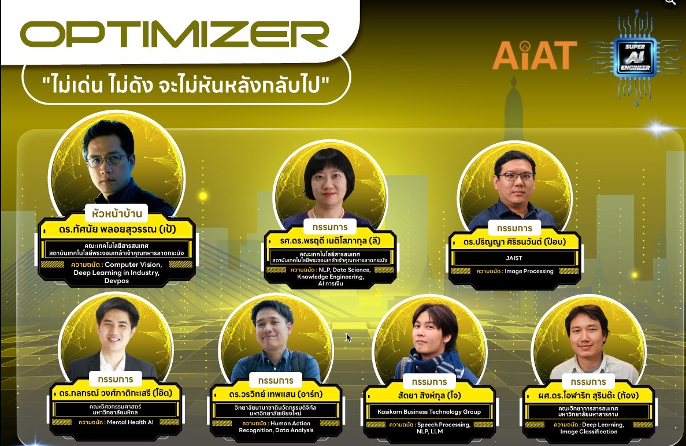

# Mastering AI Technologies: Prompt Engineering, Hugging Face and Integrating AI Technologies

This repository provides an overview of mastering key AI technologies, including:

1. Prompt Engineering 
   - Prompt Engineering และการทำการออกแบบ Prompt
   - หลักการพื้นฐานในการออกแบบ Prompt
   - เทคนิคการสร้าง Few-shot Learning Prompt และ Chain-of-Thought Prompt
   - Workshop: ฝึกสร้าง Prompt เพื่อสั่ง LLM ให้ทำงานตามข้อทดสอบ

2. Hugging Face Fundamentals
   - แนะนำ Hugging Face Ecosystem และ Pipeline
   - การโหลดและใช้ Pre-trained Model จาก Model Hub
   - การเตรียม Dataset ให้สามารถใช้กับ Hugging Face ได้จากนั้น
   - ทดลองใช้ Pre-trained Model ใน Computer Vision และ NLP Tasks

3. Fine-tuning Hugging Face for Computer Vision and NLP
   - Fine-tune  Hugging Face สำหรับงาน Image Classification 
   - Fine-tune  Hugging Face สำหรับงาน NLP

4. Connecting Vision and Language with CLIP
   - หลักการเชื่อมโยงภาพและข้อความด้วย CLIP
   - การทำ Zero-shot Image Classification ด้วย CLIP

5. Integrating AI Technologies 
   - สร้างระบบต้นแบบทางด้านวิศวกรรมด้วย CLIP
   - Zero-shot Object Detection and Segmentation
   - Object Detection and Segmentation

